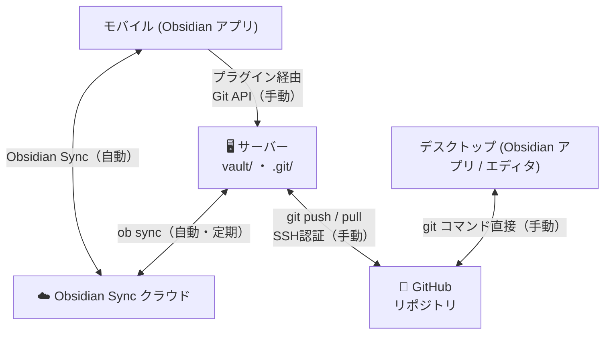

# Obsidian 3-Way Sync システム仕様書

**バージョン: v0.0.1**（2026-03-05）

---

## システム概要

モバイル / デスクトップの Obsidian ↔ **Obsidian Sync クラウド** ↔ **サーバー** ↔ GitHub を繋ぐ 3-Way Sync システム。



> **デスクトップは Obsidian Sync を使わない。**  
> デスクトップで Obsidian Sync を有効にすると、ブランチ切り替えのたびに vault/ のファイルが変わり Obsidian Sync との競合が起きるため。  
> デスクトップは git コマンドで GitHub と直接やり取りする。

### 操作主体とアクセス方法

| 操作 | モバイル | デスクトップ |
|---|---|---|
| ノートの作成・編集 | Obsidian アプリ | Obsidian アプリ or エディタ |
| Obsidian Sync | ✅ 使う（クラウド経由） | ❌ **使わない** |
| コミット & Push | **プラグイン → サーバー Git API** | `git` コマンド直接 |
| サーバーのブランチ切り替え | **プラグイン → サーバー Git API** | `git` コマンド直接（サーバー上で実行） |
| Pull | **プラグイン → サーバー Git API** | `git pull` 直接 |

---

## ユースケース別フロー

### 1. モバイルで新しいメモを追加した時

```
モバイルで編集
    ↓ Obsidian Sync（自動）→ サーバー vault/ に反映
    ↓ プラグインから「Commit & Push」ボタンをタップ（手動）
git commit + git push → GitHub に保存
```

### 2. デスクトップで feature ブランチを作業中の続きをモバイルでやりたい時

```
デスクトップで feature-x ブランチを作業 → git push origin feature-x
    ↓ モバイルのプラグインからサーバーのブランチを feature-x に切り替え
サーバー: git checkout feature-x + git pull（Git API 経由）
    ↓ vault/ の内容が feature-x の内容に切り替わる
    ↓ ob sync（次の定期実行 or Force Sync）で Obsidian Sync クラウドへ反映
モバイルが受け取り、feature-x の続きを作業
```

### 3. 外部ツールで更新したブランチをモバイルで続ける時

```
GitHub に外部ブランチが存在
    ↓ モバイルのプラグインからサーバーのブランチを切り替え
サーバー: git checkout <branch> + git pull
    ↓ ob sync でモバイルへ反映
モバイルで作業開始
```

### 4. デスクトップで作ったドキュメントをモバイルで修正する時

```
デスクトップで編集（main ブランチ）→ git commit + git push
    ↓ サーバーが git pull（または push で反映）
    ↓ ob sync でモバイルへ反映
モバイルで修正
```

### 5. モバイルで作ったメモをデスクトップで修正する時

```
モバイルで編集
    ↓ Obsidian Sync（自動）→ サーバー vault/ に反映
    ↓ プラグインから Commit & Push（手動）
デスクトップで git pull → 修正開始
```

---

## API 仕様（v0.0.1 全実装済み）

すべてのエンドポイントは `X-API-Key` ヘッダーによる認証が必要。  
認証失敗時は `401 Unauthorized` を返す。

### Obsidian Sync 系

| エンドポイント | メソッド | 説明 |
|---|---|---|
| `/api/settings` | GET | サーバー設定を取得 |
| `/api/settings` | POST | サーバー設定を更新（JSON ボディ） |
| `/api/sync/force` | POST | Obsidian Sync を強制実行（ob sync） |
| `/api/sync/status` | GET | 最終 sync 時刻・結果・Vault 状態 |

### Git 操作系

| エンドポイント | メソッド | 説明 |
|---|---|---|
| `/api/git/status` | GET | 現在のブランチ・変更ファイル一覧・クリーン状態 |
| `/api/git/branches` | GET | ブランチ一覧（local + remote 重複排除） |
| `/api/git/checkout` | POST | ブランチ切り替え + pull（追跡済み未コミット変更があれば 409） |
| `/api/git/commit` | POST | 全変更をステージしてコミット（`message` を本文で指定） |
| `/api/git/push` | POST | 現在のブランチをリモートへ push（SSH 認証） |
| `/api/git/pull` | POST | 現在のブランチをリモートから pull |

#### `/api/git/checkout` の挙動詳細

- **追跡済みファイル** の未コミット変更がある場合 → `409 Conflict`（エラーメッセージに対象ファイルを含む）
- **未追跡ファイル（`??`）のみ**の場合 → エラーにならず checkout を実行
- checkout 後に `git pull origin <branch>` を自動実行する

---

## サーバー設定

### config.json（`/api/settings` で読み書き）

| 項目 | 型 | デフォルト | 説明 |
|---|---|---|---|
| `sync_obsidian_config` | bool | `false` | `.obsidian` フォルダを同期対象に含めるか |
| `auto_sync_interval` | int | `60` | Obsidian Sync の自動実行サイクル（分） |
| `github_branch_patterns` | array | `[]` | プラグインのブランチ切り替え UI に表示するフィルタパターン（空 = 全ブランチ表示） |

#### `github_branch_patterns` のフィルタ規則

| パターン例 | マッチする例 |
|---|---|
| `"main"` | `main` のみ |
| `"feature*"` | `feature-x`、`feature-new` など |
| `[]`（空） | **全ブランチを表示**（デフォルト） |

### 環境変数

| 環境変数 | デフォルト | 説明 |
|---|---|---|
| `VAULT_DIR` | `<project root>/vault` | vault のローカルパス |
| `API_KEY` | `default-secret-key` | API 認証キー（本番では変更必須） |
| `OB_CMD` | `<project root>/node_modules/.bin/ob` | ob コマンドの絶対パス |
| `GIT_SSH_KEY_PATH` | `~/.ssh/id_rsa` | SSH 秘密鍵のパス |
| `CONFIG_FILE` | `./data/config.json` | 設定ファイルのパス |

---

## プラグイン（Obsidian Sync Bridge）v0.0.1

### 設定画面のセクション構成

#### 🔌 サーバー接続
- **Server URL** — 接続先サーバーの URL
- **API Key** — 認証キー
- **Connect & Load** ボタン — サーバーに接続して全設定・ステータスを一括取得

#### 📊 同期ステータス
- 最終 sync 時刻（日本語ローカル形式）
- 結果アイコン（✅ 成功 / ❌ 失敗 / ⏭️ スキップ / — 未実行）
- Vault 準備状態
- **🔄 更新** ボタン — サーバーの最新状態を取得して表示を更新（ob sync は実行しない）

#### Obsidian Sync 強制実行
- **Force Sync** ボタン — 今すぐ `ob sync` を実行し、完了後に表示を更新

#### ⚙️ Sync 設定
- `.obsidian フォルダを同期する` トグル
- `自動同期の間隔（分）` 数値入力

#### 🌿 Git 操作（Connect 後に表示）
- 現在のブランチと変更ファイル数の表示
- ブランチ切り替えドロップダウン（`github_branch_patterns` でフィルタ、切り替え後は自動 pull）
- 変更ファイル一覧（`<details>` で折りたたみ）
- コミットメッセージ入力
- **📝 Commit** / **⬆️ Push** / **⬇️ Pull** ボタン

### プラグインのデプロイ

| コマンド | 内容 |
|---|---|
| `pnpm run build:plugin` | TypeScript をビルドするだけ |
| `pnpm run deploy:plugin` | ビルド + `vault/.obsidian/plugins/` にコピー（デスクトップ確認） |
| `pnpm run deploy:plugin:sync` | deploy:plugin + ob sync でモバイルへ配信 |

---

## Web 管理画面（未実装・予定）

Obsidian を開いていない状態でもブラウザからサーバーを操作できる画面。  
プラグインと同じ API を使用。

- 現在の Obsidian Sync ステータス
- git ステータス（現在のブランチ・未コミット変更数）
- ブランチ切り替え・Commit & Push 操作
- Force Sync ボタン

---

## 技術的な仕様・注意事項

### GitHub SSH 認証

- SSH 秘密鍵を `GIT_SSH_KEY_PATH` で指定（デフォルト: `~/.ssh/id_rsa`）
- `git` コマンド実行時に `GIT_SSH_COMMAND` 環境変数を設定して使用
- `StrictHostKeyChecking=no` を付与（初回接続でのホスト確認をスキップ）

### ブランチ切り替え時のルール

- **追跡済みファイル**に未コミット変更がある場合は `409 Conflict` を返す（自動コミットはしない）
- **未追跡ファイル（`??`）のみ**の場合は checkout を通す（git checkout はブロックしないため）
- checkout 後に `git pull origin <branch>` を自動実行
- 切り替え後、ob sync の次のサイクルまたは Force Sync で Obsidian Sync クラウドへ反映される

### ob sync の排他制御

- `threading.Lock`（`_ob_sync_lock`）により、`force_sync` エンドポイントとバックグラウンドワーカーの ob sync が同時実行されない
- 一方が実行中の場合、もう一方はロック解放まで待機する
- 各 ob sync 実行前に `clear_sync_lock()` で ob の `.sync.lock` ディレクトリを削除する

### vault/ の git 設定

- リポジトリ: `git@github.com:ca5/obsidian.git`
- デフォルトブランチ: `main`
- `vault/.gitignore` にて `.obsidian/plugins/obsidian-sync-bridge/` を除外（ビルド成果物をコミットしない）

### デスクトップは Obsidian Sync を無効にすること

- デスクトップで Obsidian Sync を有効にすると、ブランチ切り替え時のファイル変化が競合を引き起こす
- デスクトップの Obsidian では Sync プラグインを無効化、またはサーバーとは別の Vault として開くこと
