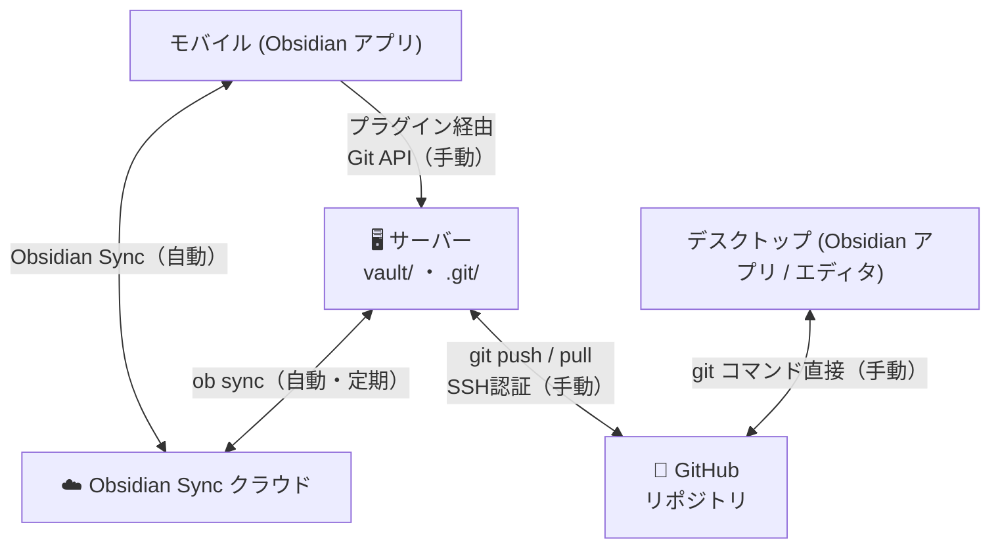

# Obsidian 3-Way Sync システム仕様書

## システム概要

モバイル / デスクトップの Obsidian ↔ **Obsidian Sync クラウド** ↔ **サーバー** ↔ GitHub を繋ぐ 3-Way Sync システム。



> **デスクトップは Obsidian Sync を使わない。**
> デスクトップで Obsidian Sync を有効にすると、ブランチ切り替えのたびに vault/ のファイルが変わり Obsidian Sync との競合が起きるため。
> デスクトップは git コマンドで GitHub と直接やり取りする。

### 操作主体とアクセス方法

| 操作 | モバイル | デスクトップ |
|---|---|---|
| ノートの作成・編集 | Obsidian アプリ | Obsidian アプリ or エディタ |
| Obsidian Sync | ✅ 使う（クラウド経由） | ❌ **使わない** |
| コミット & Push | **プラグイン → サーバー Git API** | `git` コマンド直接 |
| サーバーのブランチ切り替え | **プラグイン → サーバー Git API** | `git` コマンド直接（サーバー上で実行） |
| Pull | **プラグイン → サーバー Git API** | `git pull` 直接 |

---

## ユースケース別フロー

### 1. モバイルで新しいメモを追加した時

```
モバイルで編集
    ↓ Obsidian Sync（自動）→ サーバー vault/ に反映
    ↓ プラグインから「Commit & Push」ボタンをタップ（手動）
git commit + git push → GitHub に保存
```

### 2. デスクトップで feature ブランチを作業中の続きをモバイルでやりたい時

```
デスクトップで feature-x ブランチを作業 → git push origin feature-x
    ↓ モバイルのプラグインからサーバーのブランチを feature-x に切り替え
サーバー: git checkout feature-x + git pull（Git API 経由）
    ↓ vault/ の内容が feature-x の内容に切り替わる
    ↓ ob sync（次の定期実行 or 強制 sync）で Obsidian Sync クラウドへ反映
モバイルが受け取り、feature-x の続きを作業
```

### 3. 外部ツールで更新したブランチをモバイルで続ける時

```
GitHub に外部ブランチが存在
    ↓ モバイルのプラグインからサーバーのブランチを切り替え
サーバー: git checkout <branch> + git pull
    ↓ ob sync でモバイルへ反映
モバイルで作業開始
```

### 4. デスクトップで作ったドキュメントをモバイルで修正する時

```
デスクトップで編集（main ブランチ）→ git commit + git push
    ↓ サーバーが git pull（または push で反映）
    ↓ ob sync でモバイルへ反映
モバイルで修正
```

### 5. モバイルで作ったメモをデスクトップで修正する時

```
モバイルで編集
    ↓ Obsidian Sync（自動）→ サーバー vault/ に反映
    ↓ プラグインから Commit & Push（手動）
デスクトップで git pull → 修正開始
```

---

## API 仕様

### Obsidian Sync 系（実装済み）

| エンドポイント | メソッド | 説明 |
|---|---|---|
| `/api/settings` | GET | サーバー設定を取得 |
| `/api/settings` | POST | サーバー設定を更新 |
| `/api/sync/force` | POST | Obsidian Sync を強制実行 |
| `/api/sync/status` | GET | 最終 sync 時刻・結果・Vault 状態 |

### Git 操作系（追加予定）

| エンドポイント | メソッド | 説明 |
|---|---|---|
| `/api/git/status` | GET | 現在のブランチ・変更ファイル一覧 |
| `/api/git/branches` | GET | ブランチ一覧（local + remote） |
| `/api/git/checkout` | POST | ブランチ切り替え + pull（未コミット変更があればエラー） |
| `/api/git/commit` | POST | 変更をコミット（コミットメッセージを指定） |
| `/api/git/push` | POST | リモートへ push（SSH認証） |
| `/api/git/pull` | POST | リモートから pull |

---

## サーバー設定項目

### config.json（API 経由で変更可能）

| 項目 | 型 | 説明 |
|---|---|---|
| `sync_obsidian_config` | bool | `.obsidian` フォルダを同期対象に含めるか |
| `auto_sync_interval` | int | Obsidian Sync の自動実行サイクル（分） |
| `github_branch_patterns` | array | プラグインのブランチ切り替えUIに表示するフィルタパターン |

### 環境変数

| 環境変数 | 必須 | 説明 |
|---|---|---|
| `VAULT_DIR` | - | vault のローカルパス（デフォルト: `../vault`） |
| `API_KEY` | - | API 認証キー（デフォルト: `default-secret-key`） |
| `OB_CMD` | - | ob コマンドの絶対パス |
| `GITHUB_REPO_URL` | Git API 使用時 | SSH 形式のリポジトリ URL（例: `git@github.com:user/notes.git`） |
| `GIT_SSH_KEY_PATH` | Git API 使用時 | SSH 秘密鍵のパス（デフォルト: `~/.ssh/id_rsa`） |

---

## プラグイン（Obsidian Sync Bridge）設定画面

### 既存 UI（実装済み）

- **Server URL** / **API Key** / **Connect & Load** ボタン
- **Sync .obsidian folder** トグル
- **Sync Interval** 数値入力
- **Force Full Sync** ボタン

### 追加予定 UI

- **Sync Status** セクション：最終 sync 時刻・成功/失敗表示
- **Git** セクション（モバイルからサーバーを操作）：
  - 現在のブランチ表示
  - ブランチ切り替えドロップダウン（`github_branch_patterns` でフィルタ・切り替え後は自動で pull）
  - コミットメッセージ入力 + **Commit** ボタン
  - **Push** ボタン / **Pull** ボタン

---

## Web 管理画面（ブラウザ向け）

Obsidian を開いていない状態でもブラウザからサーバーを操作できる画面。
プラグインと同じ API を使用。

- 現在の Obsidian Sync ステータス
- git ステータス（現在のブランチ・未コミット変更数）
- ブランチ切り替え・Commit & Push 操作
- Force Sync ボタン

---

## 技術的な注意事項

### GitHub SSH 認証

- SSH 秘密鍵を `GIT_SSH_KEY_PATH` で指定
- `git` コマンド実行時に環境変数 `GIT_SSH_COMMAND` を設定して使用

### ブランチ切り替え時のルール

- 切り替え前に `git pull` で最新を取得してから `git checkout`
- `git checkout` 前に未コミットの変更がある場合は**エラーを返す**（自動コミットはしない）
- 切り替え後、ob sync の次のサイクルまたは Force Sync で Obsidian Sync クラウドへ反映される

### ob sync と git の競合防止

- `ob sync` 実行中に git 操作が行われないようにロック制御が必要（今後実装）

### デスクトップは Obsidian Sync を無効にすること

- デスクトップで Obsidian Sync を有効にすると、ブランチ切り替え時のファイル変化が競合を引き起こす
- デスクトップの Obsidian では Sync プラグインを無効化 or サーバーとは別の Vault として開くこと
